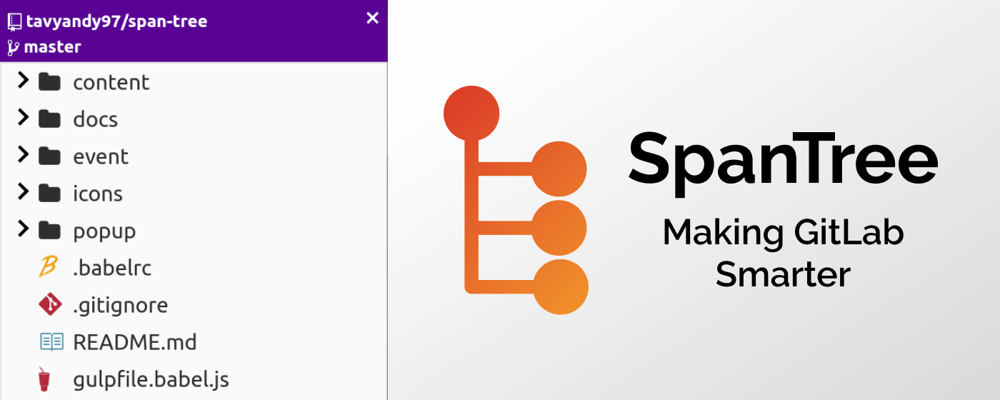

# SpanTree

  [](https://chrome.google.com/webstore/detail/spantree-gitlab-tree/gcjikeldobhnaglcoaejmdlmbienoocg) 




## About

Browser extension that makes navigating a GitLab repository feel like a breeze by providing a familiar tree structure. [Link to chrome extension](https://chrome.google.com/webstore/detail/spantree-gitlab-tree/gcjikeldobhnaglcoaejmdlmbienoocg)


## Development Setup

Pre-Requisites:

1. Install Node.js (v10.17.0)

2. Install gulp-cli

   ```
   $ npm install -g gulp-cli
   ```

Steps:

1. Clone the repository to your local system

2. Install all the dependencies

   ```bash
   $ npm install
   ```

3. Now to start the server which shall compile the extension in real time

   ```
   $ gulp watch
   ```

   (You'll observe a build folder being formed inside the project folder)

4. Load the chrome extension from the build folder. ( first enable developer mode inside Chrome)

   (For reference follow: https://thoughtbot.com/blog/how-to-make-a-chrome-extension)

# Credits

SpanTree uses the following open-source packages:

- [react](https://github.com/facebook/react)
- [redux](https://github.com/reduxjs/redux)
- [webext-redux](https://github.com/tshaddix/webext-redux)
- [file-icons](https://github.com/file-icons/atom)
- [axios](https://github.com/axios/axios)
- [immer](https://github.com/immerjs/immer)
